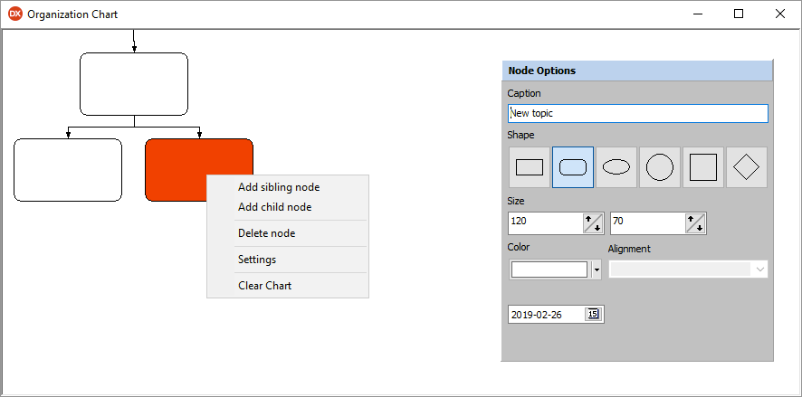

# Organization Chart

A library that provides a visual organization-chart development support for Delphi.

<!---->

## Features

* Ability to manage nodes at runtime (adding, removing, and clearing)
* Availability of two line drawing modes (zigzag lines, and straight lines)
* Special abandon mode when deleting a node, that allows removing only the selected node for deletion and reattaching its dependant nodes, or totally abandoning depenedant nodes on deletion
* Nodes support attributes such as `Topic Name`, `Creation Date`, `Width`, `Height`, `Shape`, `Color`, and `Alignment`
* Supported node shapes are `Rectangle`, `Round Rectangle`, `Ellipse`, `Circle`, `Square`, and `Diamond`

### Prerequisites

The  Organization Chart component utilizes modules from [Project JEDI](https://github.com/project-jedi), therefore you must have the following projects installed into your Delphi development environment.

* [JEDI Code Library](https://github.com/project-jedi/jcl/)
* [JEDI Visual Component Library](https://github.com/project-jedi/jvcl/)

### API

#### Methods

| Names | Description
| --- | ---
| `FullExpand` | Fully expand the nodes of the organization chart
| `FullCollapse` | Fully collapse the nodes of the organization chart
| `Clear` | Clear all nodes and reset organization chart
| `AddNode` | Add a sibling node at a specific position
| `AddChildNode` | Add a child node at a specific position
| `RenameNode` | Rename a node
| `DeleteNode` | Delete a node from the chart


## Usage

`TOrganizationChart` is a non component based class, therefore instantiation and usage is currently performed programmatically.

Here is an example instantiation from one of the accompanied demo examples.

```delphi
procedure TfrmMain.SpeedButton1Click(Sender: TObject);
begin
  OrganizationChart := TOrganizationChart.Create(frmMain);
  OrganizationChart.Width := 800;
  OrganizationChart.Height := 600;
  OrganizationChart.OnClick := OrganizationChartOnClick;
end;
```

## License

 Organization Chart is licensed under the MIT License - see the [LICENSE](LICENSE.md) file for details.
